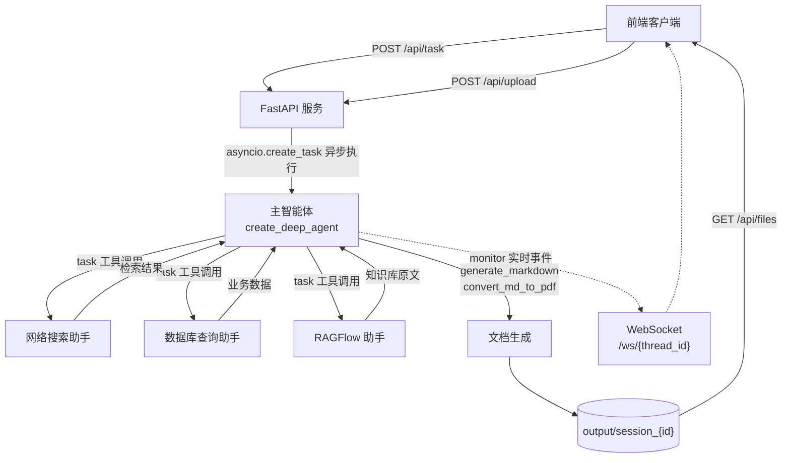

# DeepAgents · 企业级智能调研多智能体平台

> 突破传统 RAG 单次检索的局限。本项目模拟人类高级研究员思维，构建「主智能体统筹 + 多专家子智能体协作」的多路组合智能体系统，通过「搜索—阅读—反思—再搜索」多轮迭代完成复杂信息处理与文档生成。

---

## 一、项目简介

传统 RAG 是「一次检索 → 一次生成」的单轮管道，面对需要跨数据源、多轮追问的复杂调研任务时，往往因为检索不充分而给出片面结论。

本项目把调研过程拆解成**可编排的多智能体协作流程**：由一个主智能体负责规划与统筹，按需调度三个各有所长的专家子智能体去不同数据源取证，再汇总生成结构化文档。整个过程通过 WebSocket 实时回传进度，支持用户上传文件参与分析。

---

## 二、核心架构



主智能体本身**不具备检索能力**，它的职责是：
1. 理解用户意图，拆解为信息获取任务；
2. 判断应调用哪个（或全部）子智能体；
3. 接收子智能体的原始返回，决定是否需要多轮深入；
4. 信息充分后，调用文件工具产出 Markdown / PDF 文档。

---

## 三、三个专家子智能体

| 子智能体 | 职责 | 底层工具 | 数据源 |
|---|---|---|---|
| **网络搜索助手** | 公开信息的广域检索 | `internet_search` | Tavily API |
| **数据库查询助手** | 企业内部结构化数据（商品、库存、销售等明细） | `list_sql_tables` / `get_table_data` / `execute_sql_query` | MySQL |
| **RAGFlow 助手** | 企业内部非结构化知识（互联网上不流通的专有资料） | `get_assistant_list` / `create_ask_delete` | RAGFlow 知识库 |

子智能体均通过 LangGraph 的 `task` 工具由主智能体派发，遵循「先取证、后成文」的顺序约束——主智能体在拿到完整信息文本之前，被明确禁止调用文档生成工具。

### 主智能体自持工具

| 工具 | 作用 |
|---|---|
| `generate_markdown` | 根据内容生成 Markdown 文档 |
| `convert_md_to_pdf` | 将 Markdown 转换为 PDF |
| `read_file_content` | 读取用户上传的文档（txt / docx / pdf / xlsx） |

---

## 四、目录结构

```
deepagents/
├── agent/
│   ├── llm.py                      # 大模型实例初始化
│   ├── prompts.py                  # 加载 prompt/prompts.yml
│   ├── main_agent.py               # 主智能体定义 + 异步流式执行入口
│   └── subagents/
│       ├── network_search_agent.py # 网络搜索助手
│       ├── database_query_agent.py # 数据库查询助手
│       └── knowledge_base_agent.py # RAGFlow 助手
├── api/
│   ├── server.py                   # FastAPI 服务：REST + WebSocket
│   ├── monitor.py                  # 连接管理器，向指定会话推送实时事件
│   └── context.py                  # ContextVars 会话隔离
├── tools/
│   ├── tavily_tool.py              # 联网搜索
│   ├── db_tools.py                 # MySQL 查询工具集
│   ├── ragflow_tools.py            # RAGFlow 知识库工具集
│   ├── markdown_tools.py           # Markdown 生成
│   ├── pdf_tools.py                # Markdown → PDF
│   └── upload_file_read_tool.py    # 上传文件读取
├── utils/
│   ├── path_utils.py               # 路径处理
│   └── word_converter.py           # Word 转换
├── prompt/
│   └── prompts.yml                 # 主智能体与子智能体的提示词配置
├── rawflow/                        # RAGFlow 连通性验证脚本
├── requirements.txt
├── .env.example
└── 数据库脚本.txt                   # 示例业务库建表脚本
```

> `output/`、`updated/` 为运行时产生的会话目录，已在 `.gitignore` 中排除。

---

## 五、快速开始

### 环境要求

- Python 3.11+
- MySQL 5.7+ / 8.0+
- 一个 RAGFlow 服务实例（可选，若不使用知识库检索）
- Tavily API Key

### 1. 安装依赖

```bash
git clone https://github.com/05LiuHao/deepagents.git
cd deepagents
python -m venv .venv

# Windows
.venv\Scripts\activate
# macOS / Linux
source .venv/bin/activate

pip install -r requirements.txt
```

### 2. 配置环境变量

```bash
cp .env.example .env
```

然后编辑 `.env`，填入各项真实值：

| 变量 | 说明 |
|---|---|
| `OPENAI_BASE_URL` / `OPENAI_API_KEY` | 大模型服务地址与密钥（OpenAI 兼容接口） |
| `LLM_QWEN2.5` / `LLM_QWEN3` / `LLM_QWEN_MAX` | 各档位模型名称，可按需切换 |
| `TAVILY_API_KEY` | 联网搜索密钥 |
| `RAGFLOW_API_URL` / `RAGFLOW_API_KEY` | RAGFlow 服务地址与密钥 |
| `MYSQL_HOST` / `MYSQL_PORT` / `MYSQL_USER` / `MYSQL_PASSWORD` / `MYSQL_DATABASE` | 业务数据库连接信息 |

> `.env` 已被 `.gitignore` 忽略，不会进入版本库。

### 3. 初始化示例数据库（可选）

执行 `数据库脚本.txt` 中的 SQL 建表并灌入示例数据，数据库查询助手才可正常工作。

### 4. 启动服务

```bash
python -m api.server
```

服务默认监听 `0.0.0.0:8000`，接口文档见 http://localhost:8000/docs 。

---

## 六、API 接口

| 方法 | 路径 | 说明 |
|---|---|---|
| `POST` | `/api/task` | 提交调研任务。立即返回 `thread_id`，主智能体在后台异步执行 |
| `POST` | `/api/upload` | 上传文件（多文件），存入 `updated/session_{thread_id}` |
| `GET` | `/api/files?path=` | 列出输出目录下的文件及其元数据 |
| `GET` | `/api/download?path=` | 下载输出目录下的文件 |
| `WS` | `/ws/{thread_id}` | 建立长连接，实时接收该会话的执行事件 |

### 请求示例

```bash
# 1. 提交任务
curl -X POST http://localhost:8000/api/task \
  -H "Content-Type: application/json" \
  -d '{"query": "帮我调研一下当前行业趋势并生成报告", "thread_id": "demo-001"}'

# 2. 上传参考文件
curl -X POST http://localhost:8000/api/upload \
  -F "files=@参考文档.pdf" \
  -F "thread_id=demo-001"

# 3. 查看生成结果
curl "http://localhost:8000/api/files?path=<output目录绝对路径>"
```

### WebSocket 事件类型

主智能体执行过程中，`api/monitor.py` 会向对应 `thread_id` 的连接推送以下事件：

| 事件 | 触发时机 |
|---|---|
| `session_dir` | 会话工作目录创建完成 |
| `assistant` | 主智能体调用了某个子智能体 |
| `task_result` | 主智能体产出最终结果 |
| `error` | 执行过程中发生异常 |

---

## 七、关键设计说明

**会话隔离（`api/context.py`）**
服务端面向多个并发客户端，使用 `ContextVar` 保存「当前会话目录」与「当前 thread_id」。工具函数在深层调用栈中可直接读取这两个变量，无需层层传参，同时天然做到并发会话互不干扰（`ContextVar` 按协程隔离）。

**异步流式执行（`agent/main_agent.py`）**
主智能体采用 `astream()` 而非 `invoke()`：一方面长耗时调研任务不会阻塞事件循环，另一方面可以逐块解析流式输出——识别到 `tool_calls` 中的 `task` 调用时，即向该会话推送「正在调用某子智能体」；识别到最终 `content` 时，推送最终结果。

**工作目录约束**
每次任务开始时，系统会动态生成 `output/session_{id}` 作为该会话的工作目录，并把**相对路径**写入提示词的「工作环境指令」段落。提示词中明确要求模型只使用相对路径、禁止绝对路径，从而避免模型把文件写到工作目录之外。若该会话存在用户上传的文件，`updated/session_{id}` 中的文件会先被复制进工作目录，并在提示词中告知模型优先读取。

**路径越权防护（`api/server.py`）**
`/api/files` 与 `/api/download` 在解析用户传入的 `path` 后，会校验其是否位于 `output` 目录之下（`Path.is_relative_to`），阻断目录穿越读取。

**提示词外置（`prompt/prompts.yml`）**
主智能体与三个子智能体的 system prompt、描述均集中在 YAML 中。`prompts.py` 负责加载，`agent/llm.py` 负责模型实例化。切换业务场景时只需改这一个文件，无需改动代码逻辑。

---

## 八、技术栈

| 层次 | 技术 |
|---|---|
| 智能体框架 | `deepagents`（`create_deep_agent`）、LangChain、LangGraph |
| 大模型 | OpenAI 兼容接口（默认对接通义千问系列） |
| 检索来源 | Tavily（联网）、MySQL（结构化）、RAGFlow（知识库） |
| Web 服务 | FastAPI + Uvicorn + WebSocket |
| 文件处理 | python-docx、pypdf、pandas、openpyxl |
| 配置管理 | python-dotenv、PyYAML、Pydantic |

---

## 九、说明

- 本项目为个人学习与实践项目，聚焦多智能体协作编排与流式实时反馈的工程实现。
- `数据库脚本.txt` 提供的是示例业务库结构，实际部署时请替换为自有数据。
- 前端不在本仓库范围内，服务端已提供完整的 REST + WebSocket 接口，可直接对接。
